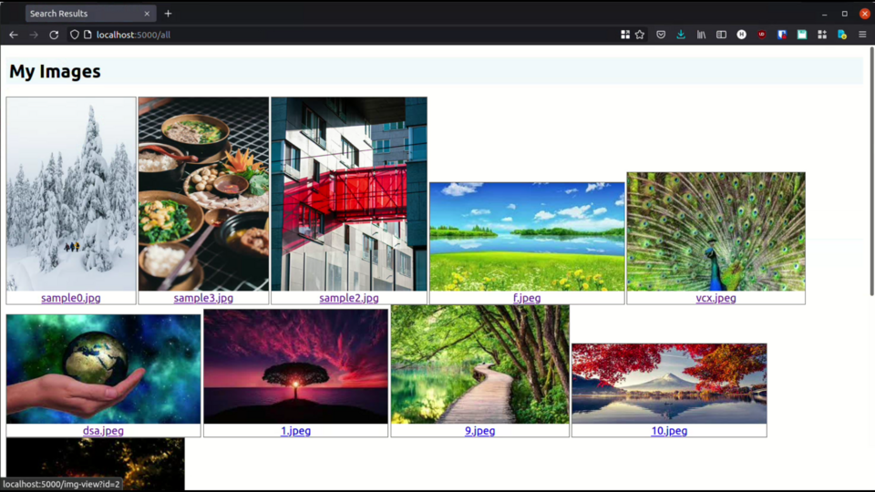
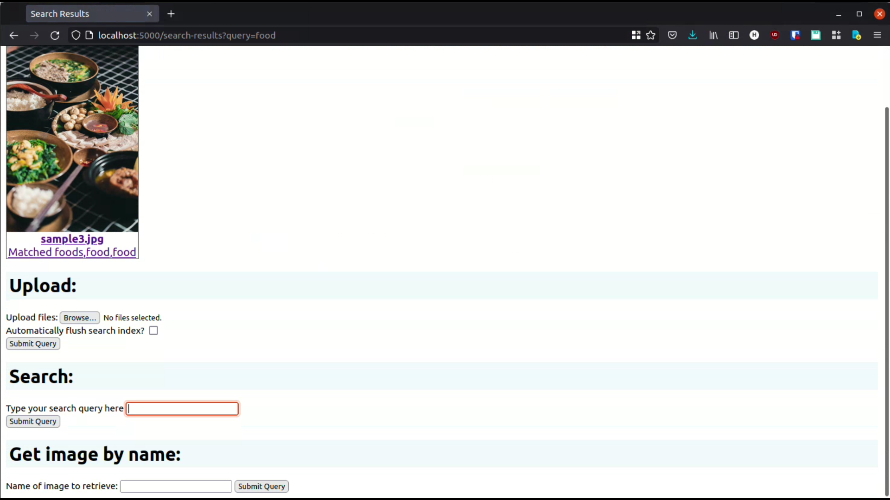
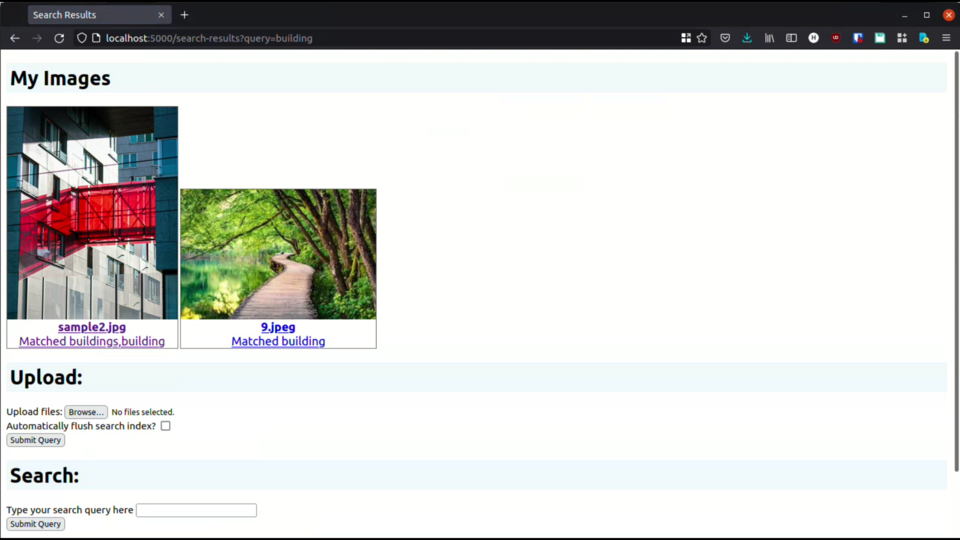
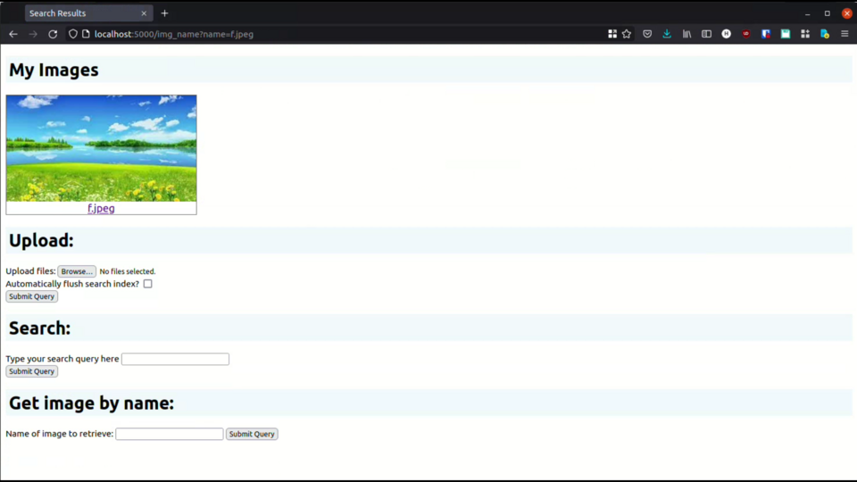

# Shopify Developer Challenge - Image Repository

Image repository which allows users to store, browse, delete, and search for images. [Video](fdsa)

# Screenshots

**For each of these screenshots, see the URL for query parameters passed to the backend**

##### Searching for the word "food"

##### Searching for the word "building"

##### Getting image by filename

### Tech stack

**Frontend**: Basic HTML

**Backend**: Python Flask

**Database**: [Custom built in Rust](https://github.com/econaxis/db1)

**Search engine**: [Custom built in C++](https://github.com/econaxis/search)

**Image to text**: Azure Cognitive Services API

### Why use a custom database?

This project was a good opportunity to showcase my own database, that it was actually usable in a real scenario. Since
this is a personal project and I have full control over tech stack, I opted to use my own software. This lets me have a
vertical understanding throughout the whole tech stack.

Otherwise, for a production-grade application, I would've used SQLite or Postgres instead for their reliability and
features.

### About the database

The database implements a basic table interface with 4 columns: `id (primary key)`, `filename`, `metadata`, and `data`.
Each image is assigned a numeric ID, which is used to query, update, and delete. To support querying by filename, I
added secondary index functionality to the database.

It also shuffles columns (converting row-oriented to column-oriented data format) for more efficient compression,
using `zstd`.

These features contain all I need to make an image repository.

### About the search engine

Searching images is usually done using vector embeddings and a database that supports it (like Pinecone, Google's).
However, I already had built a textual search engine long ago. I figured that by using Azure's image description API, I
could convert images to text, and rely on my existing search infrastructure to perform searching and storage.

#### More about emulating image search with text search

If I add an image of a cat in a park into the repository, it will use Azure's ML API to generate things in the image,
like `cat`, `park`, `grass`, `sun`. This alone is not enough to power search. For example, what if I'd searched "
meadows" or "field." This image is similar to a meadow, or a field, but the text search engine doesn't know anything
about this.

To solve this problem, I used a Word2Vec model to get 100 nearest neighbours of the vector embedding of those words. In
other words, I generate 100 synonyms of those words.

These synonyms will likely contain "meadow" or "field," thus increasing the chance that my image will show up.

Of course, this is a subpar solution compared to vector embeddings. However, using my own software and having a deep,
vertical understanding of it gives me joy.

### Problems

- Ownership of data, strings, and buffers across the Python-Rust FFI barrier
- Reliability of the database
- Fast secondary indexing
- Storing two simultaneously growing tables (main table and secondary index table) without moving data around

These were the interesting problems I encountered. I'd love to talk more about them in an interview!

## File Organization

`app.py`: Entrypoint (single-threaded Flask)
`main.py`: Public API endpoints
`api.py`: Private API endpoints
`DB.py`: Database/search engine handles
`picture.py`: Picture processing, thumbnail generation

## Next Steps

The DB and search engine handles are not mutex-protected. The next step is to implement thread-safety so Flask can run
with multiple workers.

The DB also requires a flush (hence the checkbox "automatically flush index?" on the UI) for persistence. If the user
uploads data, but the application crashes before the database is flushed, we lose that data. The next step is
implementing a write-ahead log so all writes are persistent even if there are crashes.

Implement actual image search using vector embeddings instead of repurposing textual search.

Image compression. While there is compression at the database layer, we do send full sized images to the client. This is
wasteful, especially in the `/all` page where we show all the images in a small grid. The next step is to add two image
loading schemes - a small, compressed image endpoint and a full-size image endpoint.

## Using

To run this application, you need the following shared library files:

`libc-search-abi`, `libsearch-share`: Search engine - querying, loading indices
`libcompactor`: Compacts search indices for performance
`libgeneral-indexer`: Indexing and creating search indices
`libdb2`: Database

They are included in the repo, but were compiled for x86_64 Linux with GLIBC version 2.33. If these specs don't match
your system, you should compile these libraries yourself. The source code is available and linked at the top.

*Note: building the search engine requires AVX2 support. AVX is used for deserializing postings lists.*

Then, run `python3 app.py` to start the Flask server.

